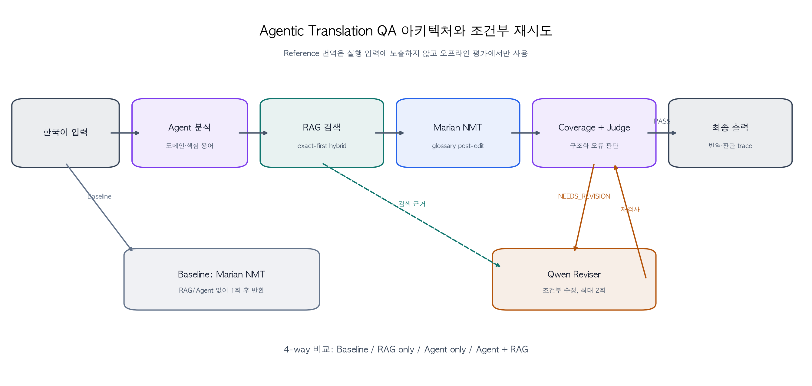

# 시스템 아키텍처와 Agent 워크플로우

## 1. 구현 범위

이 시스템은 한국어 문장 하나를 입력받아 영어로 번역하고, 필요할 때만 검색과
Agent 검수를 거쳐 최대 2회 수정하는 로컬 Translation QA 프로토타입이다.
Python 3.11 이상과 FastAPI를 사용하며 외부 유료 API는 호출하지 않는다.

구현은 동일한 기본 번역 모델을 공유하는 네 실행 조건을 제공한다.

| 실행 조건 | RAG | Agent 판단·수정 | 목적 |
|---|---:|---:|---|
| Baseline | 없음 | 없음 | 기본 NMT 성능 기준선 |
| RAG only | 있음 | 없음 | glossary 검색의 단독 기여 측정 |
| Agent only | 없음 | 있음 | Agent 판단·수정의 단독 기여 측정 |
| Agent + RAG | 있음 | 있음 | 과제의 제안 방식 |

필수 외부 API는 Baseline과 Agent+RAG를 노출하고, 내부 benchmark에서는 네 조건을
모두 실행할 수 있도록 해 RAG와 Agent의 기여를 분리했다.

## 2. 아키텍처

| 구성요소 | 실제 구현 | 책임 |
|---|---|---|
| API | FastAPI | 요청 검증, 실행 모드 선택, 오류 응답 |
| Controller | 결정적 Python 상태기계 | 단계 순서, 최대 retry, 종료·fallback, trace |
| NMT | `Helsinki-NLP/opus-mt-ko-en` | 모든 조건이 공유하는 초기 한→영 번역 |
| RAG | exact-first hybrid glossary retrieval | 원문·도메인에 맞는 표준 용어 근거 검색 |
| 용어 반영 | 결정적 glossary post-edit | 검색된 명시적 replacement rule 반영 |
| Judge/Reviser | Ollama `qwen3:1.7b` | 구조화 품질 판정과 조건부 수정 |
| Coverage guard | source coverage 검사 | 주어·고유명사·핵심 기술어 보존 감사 |
| Benchmark | 고정 평가셋 runner | 네 조건 지표와 trace artifact 생성 |

Controller를 별도 다중 Agent 조직 대신 명시적 상태기계로 구현한 이유는 최대
3개 후보의 작은 워크플로우에서 상태 전이, call count, fallback과 종료 사유를
재현 가능하게 남기기 위해서다.

## 3. Agent+RAG 실행 순서

1. `TranslationRequest`는 source 문장만 받는다. Reference와 수동 정답은 runtime에
   전달하지 않는다.
2. Agent가 도메인과 핵심 용어를 구조화된 `SourceAnalysis`로 만든다.
3. 원문에 실제로 나타나는 glossary 항목을 exact 우선으로 검색하고, 부족한 경우에만
   vector 후보를 보조로 사용한다.
4. Marian NMT로 초기 후보를 한 번 만든다. 검색된 replacement rule이 있으면
   glossary post-edit를 적용한다.
5. 각 후보 직후 source coverage를 검사하고, Judge가 구조화 오류 유형과 품질
   요약을 반환한다.
6. 오류가 없으면 즉시 종료한다. 오류가 있고 구체적 개선 근거가 있을 때만 검색
   보강 또는 Reviser 수정으로 분기한다.
7. 추가 시도는 최대 2회다. 따라서 초기 후보를 포함한 최대 후보 수는 3개다.
8. 개선되지 않거나 구성요소 오류가 나면 이미 만든 후보 중 안전한 후보로
   fallback하고 종료 사유를 기록한다.

## 4. 검색과 제약의 경계

Marian은 일반 LLM처럼 glossary 문장을 prompt로 자연스럽게 소비하지 않는다.
파일럿에서 `force_words_ids`는 반복·퇴행 출력을, source augmentation은 용어
미반영을 보였다. 최종 runtime은 다음 경계를 둔다.

- NMT 입력에는 임의의 영어 설명문을 덧붙이지 않는다.
- glossary에 명시된 replacement rule만 결정적으로 후처리한다.
- 임시 `must-preserve` 요구는 Reviser에만 전달하고 NMT 제약으로 위장하지 않는다.
- targeted retrieval 결과는 기존 hit과 병합하고 `term_id`로 dedupe한다.
- 검색 실패 시 기존 검색 근거를 버리지 않는다.

이 선택은 생성 품질 전체를 보장하지는 않지만, 어떤 용어가 왜 바뀌었는지를
추적하고 Baseline과 같은 기본 번역기를 유지하는 데 유리하다.

## 5. 판정·재시도·종료 계약

| 조건 | 처리 |
|---|---|
| 구조화 오류 없음 | `PASS`, `accept`, 즉시 종료 |
| 용어 근거 부족 | 필요한 source span으로 targeted RAG |
| 주어·고유명사 누락 | Reviser용 임시 must-preserve constraint |
| 수정 후 여전히 오류 | 남은 retry가 있으면 한 번 더 수정 |
| 동일 후보 반복 | 불필요한 루프를 중단 |
| 최대 retry 소진 | trace를 보존하고 최선 후보 선택 |
| Agent/LLM 장애 | 번역 후보를 보존한 채 component failure 또는 fallback 종료 |

Judge의 자유 서술보다 구조화 오류 항목이 판정 근거가 되도록 스키마 일관성을
검사한다. 다만 동결 benchmark 결과는 이 후속 guard 개선 전 S1 실행 결과이므로,
현재 코드 구조와 과거 성능 수치를 같은 실험 결과로 혼동해서는 안 된다.

## 6. Trace와 감사 가능성

`TranslationResponse.trace`는 다음 정보를 보존한다.

- source analysis와 coverage requirements
- attempt index, 부모 후보와 후보 생성 주체
- retrieval query, hit, score와 적용 glossary constraint
- 각 attempt의 번역 후보, coverage finding과 Agent judgment
- 요청된 action과 실제 적용 action
- 분석·검색·번역·수정·판정·전체 latency
- 구성요소별 호출 횟수
- 최종 후보 index, 선택 이유, stop reason, warning, model version

Reference와 manual label은 `EvaluationCase.to_translation_request()`에서 제거된다.
오프라인 metric 계산 단계만 이 gold 필드에 접근하므로, 실행 중 정답 누수를 막는다.

## 7. 현재 범위의 한계

- 단일 프로세스·로컬 모델 기준이며 인증, 큐, 수평 확장, 운영 모니터링은 없다.
- vector backend는 작은 glossary에 맞춘 in-memory cosine 구현이다. 대규모 문서용
  FAISS/Chroma 운영 구성이 아니다.
- source coverage의 보수적 규칙은 일부 한글 고유명사와 의역을 판별하지 못한다.
- Agent 자체 평가에는 자기확증 편향과 JSON 출력 불안정성이 남는다.
- 동결 benchmark 뒤 추가된 guard는 동일 전체셋에서 재평가하지 않았으므로,
  최종 성능 향상으로 주장하지 않는다.

## 8. 구현 근거

- Controller: [`../src/translation_qa/pipeline.py`](../src/translation_qa/pipeline.py)
- API wiring: [`../src/translation_qa/main.py`](../src/translation_qa/main.py)
- 계약 스키마: [`../src/translation_qa/schemas.py`](../src/translation_qa/schemas.py)
- 설정: [`../src/translation_qa/config.py`](../src/translation_qa/config.py)

