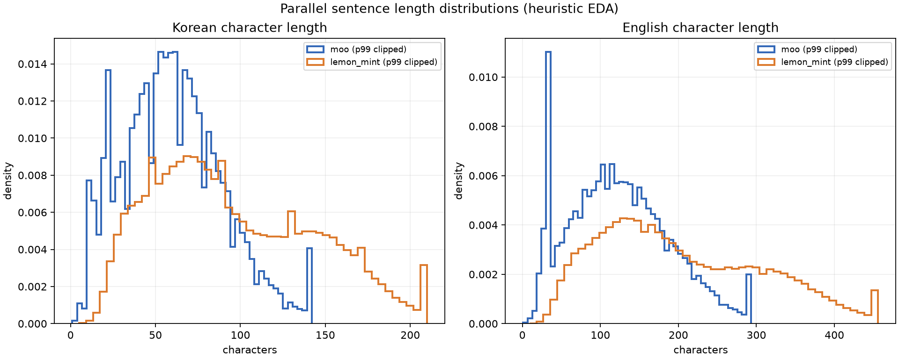
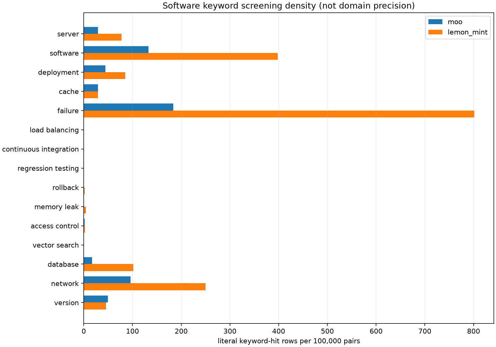
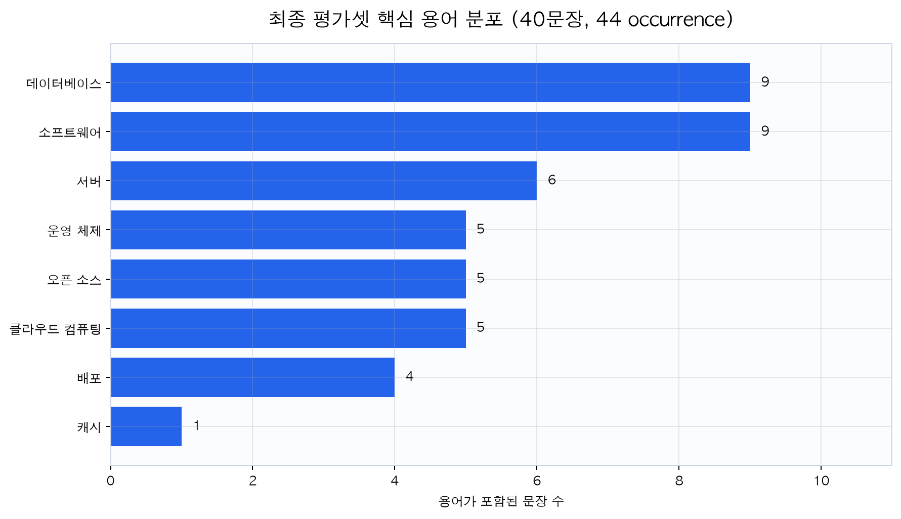
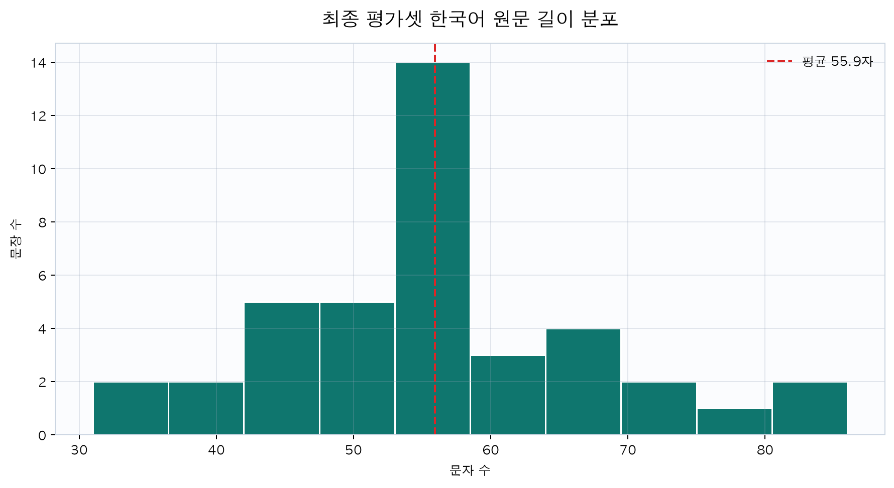

# 평가 데이터셋과 EDA

## 1. 평가셋 요약

| 항목 | 최종 값 |
|---|---|
| 데이터 원본 | `lemon-mint/korean_parallel_sentences_v1.1` |
| 고정 revision | `c3ffa5bfe5bf0cd5b4d634e863978b5eb265c9e1` |
| 라이선스 | MIT |
| 번역 방향 | 한국어 → 영어 |
| 도메인 | software 단일 도메인 |
| 문장 수 | 40 |
| 서로 다른 핵심 용어 | 8 |
| 필수 용어 occurrence | 44 |
| 복수 용어 문장 | 4 |
| reference | 공개 영어 reference 34건 + 사전 검수 correction 6건 |
| 동결 상태 | `HUMAN_CONFIRMED_FROZEN`, benchmark 허용 |
| dataset SHA-256 | `cdef83d7a78de9071cb850890c1c408cbf0573e5501a21086026f232501e6650` |

과제의 30~50문장, 단일 도메인, 핵심 용어 5개 이상, 영어 reference 조건을
모두 만족한다.

## 2. 공개 데이터 비교

두 후보 데이터셋을 로컬 cache에서 동일한 방식으로 프로파일링했다.

| 지표 | Moo 병렬 데이터 | lemon-mint v1.1 |
|---|---:|---:|
| 전체 행 | 99,215 | 492,564 |
| 중복 pair 비율 | 15.40% | 2.27% |
| anomaly flag 비율 | 2.41% | 0.33% |
| software keyword 후보 | 490 | 8,248 |
| 서로 다른 keyword hit | 9 | 14 |
| 한국어 길이 평균 / 중앙 / p95 | 60.4 / 59 / 112 | 96.3 / 87 / 180 |

lemon-mint를 선택한 이유는 행 수가 많아서가 아니라, 중복·anomaly 비율이 낮고
software 후보와 서로 다른 용어가 충분해 40문장을 층화 선정하기 쉬웠기 때문이다.
이 비교는 자동 EDA이며 reference의 언어 품질을 자동으로 보증하지는 않는다.

## 3. 선정 절차와 누수 방지

1. 파일럿과 최종 평가를 분리했다.
2. 최종 reference를 보지 않고 software source 문장과 독립 glossary를 먼저
   고정했다.
3. Parquet 1차 selection은 한국어 source 열만 읽어 source record ID를 확정했다.
4. NFKC 정규화, 원문 중복 제거, source term boundary 검사와 seed 42를 적용했다.
5. source ID가 고정된 후에만 영어 reference를 join했다.
6. AI 보조 후보 검토 뒤 사람이 40행과 reference를 확인했다.
7. 수정된 reference도 원 공개 reference, hash, rationale와 검수 provenance를 함께
   보존했다.
8. runtime request는 source text만 포함하며 reference와 expected term label을
   전달하지 않는다.

Glossary를 최종 reference에서 역추출하지 않았으며, 최종셋을 본 뒤 잘 맞는 문장만
제외하지 않았다.

## 4. 최종 평가셋 EDA

### 4.1 용어 분포

| 핵심 용어 | occurrence |
|---|---:|
| 데이터베이스 | 9 |
| 소프트웨어 | 9 |
| 서버 | 6 |
| 운영 체제 | 5 |
| 오픈 소스 | 5 |
| 클라우드 컴퓨팅 | 5 |
| 배포 | 4 |
| 캐시 | 1 |

8개 용어와 44 occurrence를 포함해 최소 5개 용어 조건은 여유 있게 만족한다.
다만 `캐시`는 1회뿐이므로 용어별 성능을 안정적으로 일반화할 수 없다.

### 4.2 문장 길이

| 통계 | 한국어 문자 수 |
|---|---:|
| 최소 | 31 |
| 평균 | 55.925 |
| 중앙값 | 56 |
| 최대 | 86 |

짧고 중간 길이의 설명문 중심이며, 장문 문서·대화·문맥 의존 문단을 평가하지
않는다.

### 4.3 구조와 reference

- 40문장 모두 `software` 도메인이다.
- 36문장은 핵심 용어 1개, 4문장은 2개 이상을 포함한다.
- 공개 reference 34건은 그대로 유지했다.
- 정렬·의미 축약 문제가 확인된 6건은 사람 검수 correction을 적용했고 원문과
  원 reference를 provenance에 보존했다.
- 모든 case에는 고정 `case_id`, source record ID, selection note, expected term이
  있다.

## 5. EDA가 설계에 미친 영향

- Bare glossary가 작고 literal term이 명확해 exact retrieval을 우선했다.
- `배포`, `서버`, `데이터베이스` 같은 반복 용어로 occurrence 기반 term accuracy를
  계산할 수 있게 했다.
- 한 용어에만 표본이 몰리지 않도록 층화했지만, 40문장은 통계적 일반화를 위한
  대규모 평가셋이 아니다.
- 공개 reference가 완전한 gold라고 가정하지 않고 사람 검수 overlay를 분리했다.

## 6. 한계

- 공개 데이터에서 source keyword로 선별했으므로 자연 발생 전체 분포를 대표하지
  않는다.
- software 단일 도메인 결과를 의료·법률·일상 회화로 일반화할 수 없다.
- 40문장과 44 occurrence는 방향성을 보는 소규모 과제 평가다.
- 용어 빈도가 불균형하고 `캐시`는 단일 사례다.
- 영어 reference 품질은 검수했지만, 다중 정답을 모두 포함하는 완전한 reference는
  아니다.
- 최종 benchmark 이후 설정을 튜닝하면 같은 evaluation_v1을 다시 최종 독립
  평가라고 부를 수 없다. 다음에는 reserve 또는 새 고정 표본이 필요하다.

## 7. 근거 파일

- 최종셋: [`../data/evaluation_v1.jsonl`](../data/evaluation_v1.jsonl)
- EDA summary: [`../artifacts/eda/evaluation_v1_summary.json`](../artifacts/eda/evaluation_v1_summary.json)
- 데이터 비교: [`../artifacts/eda/dataset_comparison.json`](../artifacts/eda/dataset_comparison.json)
- reference review: [`../data/reference_reviews/evaluation_v1.json`](../data/reference_reviews/evaluation_v1.json)
- 데이터 설명: [`../data/README.md`](../data/README.md)

