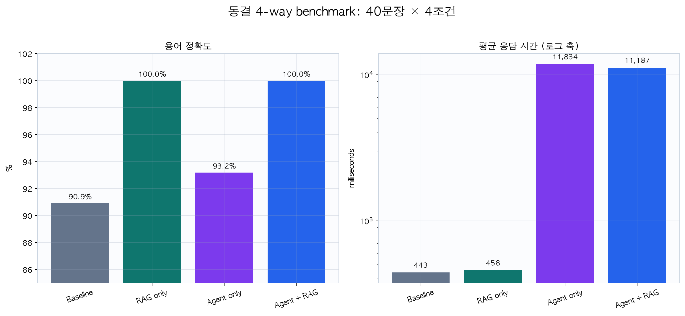
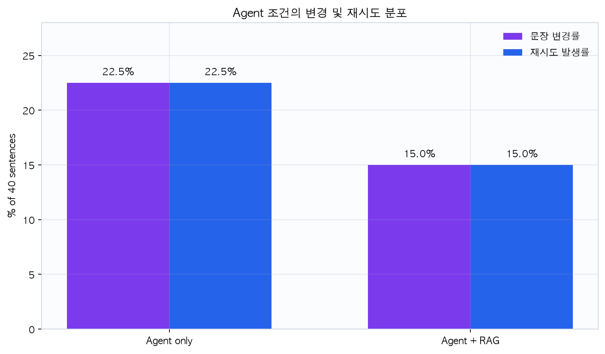
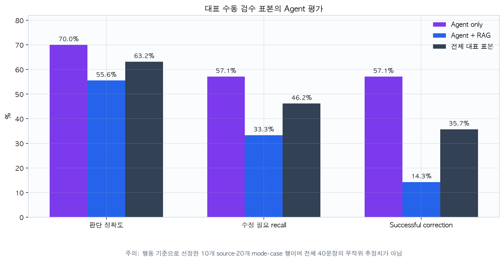
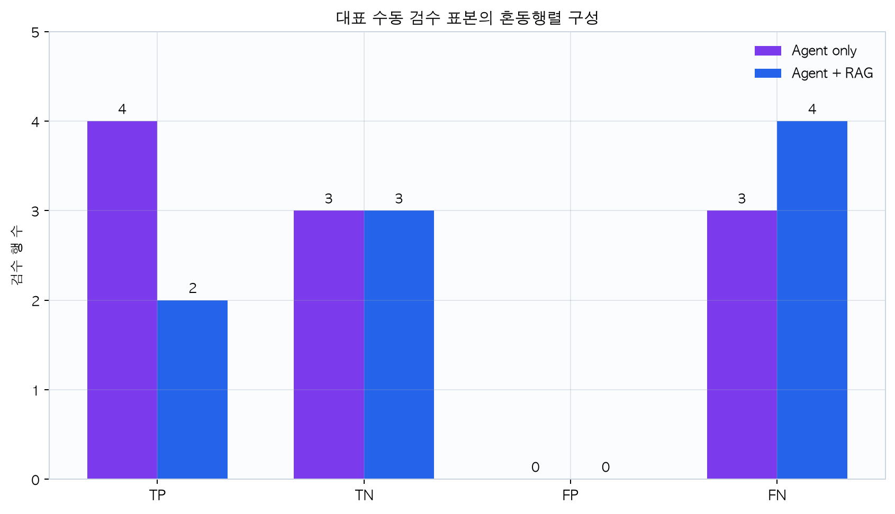

# Benchmark 결과

## 1. 평가 범위와 해석 원칙

동결 run `429d6c4a-a1b6-4514-bfd3-dab6966c4101`에서 40문장을 네 조건으로
한 번씩 실행해 160개 결과를 만들었다.

- dataset: `evaluation_v1`, 40문장, 44 glossary occurrence
- 동일 기본 NMT와 동일 데이터 사용
- warm-up 활성화, batch size 1 순차 실행
- 빈 번역 0건
- artifact SHA-256:
  `e0f858ca97ff8d0130e016660f037b421cce0b7c5fdb7721a2fae50c319590cf`
- config SHA-256:
  `2a2935ab0c366522aeae3cbbbb7c7e35c1fe96c654b3131bdcca164daaee16b1`

자동 용어 정확도는 glossary occurrence만 평가하며 문장 전체 의미 정확도를 뜻하지
않는다. Latency도 이 머신의 단일 동결 run 관찰값이며 반복 측정에 기반한 SLA가
아니다.

## 2. 4-way 결과

| 조건 | 용어 정확도 | 평균 / 중앙 / p95 latency | 문장 변경 | retry 분포 |
|---|---:|---:|---:|---:|
| Baseline | 40/44 = **90.9%** | 442.65 / 412.81 / 628.21 ms | N/A | N/A |
| RAG only | 44/44 = **100.0%** | 458.20 / 425.49 / 641.16 ms | N/A | N/A |
| Agent only | 41/44 = **93.2%** | 11,833.72 / 9,392.60 / 21,943.63 ms | 9/40 = **22.5%** | 0회 31, 1회 9 |
| Agent + RAG | 44/44 = **100.0%** | 11,187.07 / 9,285.75 / 22,367.25 ms | 6/40 = **15.0%** | 0회 34, 1회 6 |

## 3. 자동 지표 해석

### RAG의 기여

RAG only는 Baseline보다 glossary 정답 occurrence를 4개 늘려 90.9%에서 100%가
됐다. 평균 추가 시간은 약 15.55ms, 약 3.5%였다. 작은 고정 glossary에서 exact
우선 정책과 결정적 post-edit가 표준 용어 반영에는 효과적이었다.

다만 100%는 표시된 44개 term occurrence가 accepted target을 포함했다는 뜻이다.
주어 누락, 문맥 오류, 추가 정보, 문법 오류는 이 지표로 잡히지 않는다.

### Agent의 비용과 동작

Agent only는 9문장, Agent+RAG는 6문장을 수정했다. 조건부 retry가 실제로 작동했고
모든 문장을 무조건 재시도하지 않았다. 반면 평균 latency는 약 11초로 Baseline의
약 25~27배다. 작은 로컬 LLM의 분석·판정·수정 호출이 주요 비용이다.

문장 변경률은 활동량 지표이지 품질 지표가 아니다. Agent only 22.5%가
Agent+RAG 15.0%보다 높다는 사실만으로 더 좋은 품질을 의미하지 않는다.

## 4. 수동 Agent 판단 평가

### 표본 설계

전체 40문장을 무작위 검수한 것이 아니라, 서로 다른 동작을 감사하기 위해 두
배치를 의도적으로 선택했다.

| 배치 | 행 | 표본 성격 |
|---|---:|---|
| Batch 1 | 5 source × 2 mode = 10 | retry, 모드 불일치, component failure 중심 |
| Batch 2 | 별도 5 source × 2 mode = 10 | 두 모드가 첫 시도 PASS한 사례 중심 |
| 합계 | 10 source, 20 mode-case | 진단용 대표 표본, 무작위 표본 아님 |

Positive class는 사람이 `NEEDS_REVISION`으로 판정한 경우다. Component failure
1건은 첫 judgment가 없어 confusion matrix 분모에서 제외했다.

| 범위 | TP / TN / FP / FN | 판단 정확도 | 수정 필요 recall | MAJOR false PASS | Successful correction | Component failure |
|---|---:|---:|---:|---:|---:|---:|
| 전체 | 6 / 6 / 0 / 7 | 12/19 = **63.2%** | 6/13 = **46.2%** | **7** | 5/14 = **35.7%** | 1/20 |
| Agent | 4 / 3 / 0 / 3 | 7/10 = **70.0%** | 4/7 = **57.1%** | 3 | 4/7 = **57.1%** | 0/10 |
| Agent+RAG | 2 / 3 / 0 / 4 | 5/9 = **55.6%** | 2/6 = **33.3%** | 4 | 1/7 = **14.3%** | 1/10 |

### Successful correction 정의

Confirmed initial label이 수정을 요구하고 initial→final outcome도 confirmed인 행만
분모로 삼는다. 그중 사람이 `IMPROVED`로 판정한 행이 분자다. Component failure
행도 사람이 initial과 final을 검토할 수 있어 이 지표의 분모에는 남지만, 사용
가능한 첫 Agent judgment가 없으므로 판단 정확도 분모에서는 빠진다.

## 5. Baseline vs 제안 방식 결론

| 질문 | 동결 결과에서 확인된 답 |
|---|---|
| RAG가 필수 용어를 개선했는가? | 예. 40/44 → 44/44 |
| Agent가 조건부 retry를 수행했는가? | 예. Agent 9건, Agent+RAG 6건 |
| Agent가 문장 품질을 안정적으로 판정했는가? | 아직 아님. 진단 표본 recall 46.2% |
| Agent+RAG가 Agent보다 항상 좋았는가? | 주장할 수 없음. 작은 행동 선정 표본에서는 오히려 낮았음 |
| 비용은? | RAG only는 작았지만 Agent 경로는 약 11초 |

제안 방식은 “용어 정확도를 높이고 필요할 때만 retry하는 워크플로우”라는 기능적
목표는 달성했다. 그러나 사람 기준 문장 품질에서는 MAJOR false PASS가 7건이고
successful correction이 35.7%여서, 완성된 품질 보증 시스템으로 보기는 어렵다.

## 6. 통계·일반화 한계

- Latency는 계약상 3회 반복이 바람직하지만 현재 표는 동결 단일 run이다.
- 수동 검수는 20행이지만 실제로는 10 source의 paired mode 결과다.
- 두 배치는 실패·PASS 동작을 의도적으로 선정했으므로 전체 40문장의 무작위
  품질 추정치가 아니다.
- 수동 수정 필요 14행이 모두 MAJOR이며 MINOR 사례가 없다.
- Agent+RAG의 낮은 수치로 RAG가 일반적으로 해롭다는 인과 결론을 내릴 수 없다.
- 현재 코드에 추가된 후속 guard는 이 동결 run 뒤의 변경이므로 표의 성능에
  반영됐다고 주장하지 않는다.

## 7. 근거 파일

- Benchmark artifact: [`../artifacts/benchmark-429d6c4a-a1b6-4514-bfd3-dab6966c4101.json`](../artifacts/benchmark-429d6c4a-a1b6-4514-bfd3-dab6966c4101.json)
- Batch 1 score: [`../data/manual_reviews/evaluation_v1_batch1_severity/scores.json`](../data/manual_reviews/evaluation_v1_batch1_severity/scores.json)
- Batch 2 score: [`../data/manual_reviews/evaluation_v1_batch2/scores.json`](../data/manual_reviews/evaluation_v1_batch2/scores.json)
- 평가 계약: [`../docs/EVALUATION_CONTRACT.md`](../docs/EVALUATION_CONTRACT.md)

