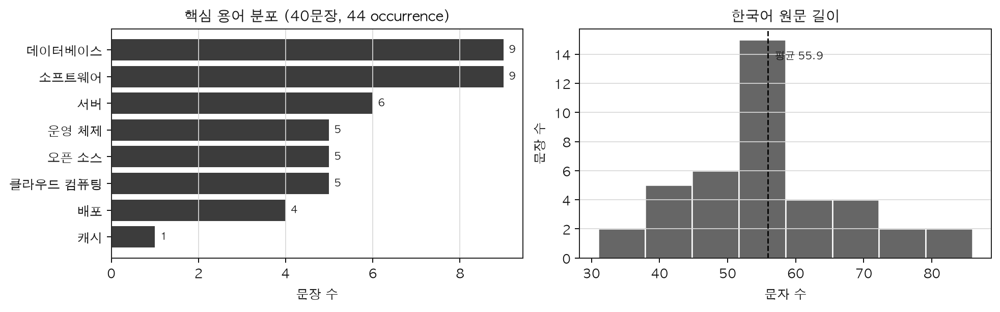
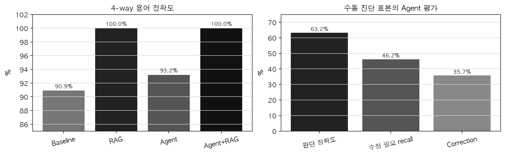

# RAG + Agent 기반 Agentic Translation QA

## 최종 구현 및 평가 보고서

### 1. 요약 및 시스템 구성

본 과제는 한국어→영어 번역에서 도메인 용어와 문장 품질을 검수하는 로컬
Translation QA 워크플로우를 구현한다. Python 3.11+, FastAPI와 공개 로컬 모델만
사용하며 유료 API는 호출하지 않는다.

```text
한국어 입력 → Agent 분석 → glossary RAG → Marian NMT
            → source coverage + Judge → 조건부 수정(최대 2회) → 최종 출력·trace
```

동일 Marian 번역기를 공유하는 `Baseline / RAG / Agent / Agent+RAG` 네 조건을
구현해 RAG와 Agent의 기여를 분리했다. 필수 API도 모두 구현돼 있다.

| API | 역할 |
|---|---|
| `POST /translate/baseline` | 기본 NMT 번역과 trace |
| `POST /translate/agent-rag` | RAG+Agent 번역, 판단, retry trace |
| `POST /benchmark` | 고정 평가셋의 모드별 지표와 artifact |

모든 attempt에는 검색 hit, 후보 번역, 판단, 단계별 latency와 stop reason을 남긴다.
Reference와 수동 label은 runtime에 전달하지 않고 오프라인 채점에서만 사용한다.

### 2. 모델·프레임워크 선택 이유와 한계

| 영역 | 선택과 이유 | 확인된 한계 |
|---|---|---|
| 번역 | `Helsinki-NLP/opus-mt-ko-en`: 공개 한→영 모델, CPU 로컬 실행, 네 조건 공통 기준선 | 도메인 용어, 주어·고유명사 누락; prompt 방식 glossary 주입에 부적합 |
| Agent | Ollama `qwen3:1.7b`: 16GB 환경에서 가능한 소형 multilingual JSON 모델 | 약 11초 latency, false PASS, JSON/error label 불안정, 자기평가 편향 |
| 임베딩 | multilingual MiniLM: 작고 한국어·영어를 함께 검색 가능 | 작은 literal glossary에서 vector noise |
| 검색 | exact-first hybrid + in-memory cosine: exact 우선, vector 보조 | 대규모 영속 index와 운영 확장성 부족 |
| API/흐름 | FastAPI·Pydantic + 결정적 Python controller | 인증·queue·checkpoint·분산 운영 미구현 |

파일럿에서 `force_words_ids`는 반복·퇴행 출력을, source augmentation은 용어
미반영을 보여 채택하지 않았다. Exact retrieval은 12/12를 찾았지만 vector는 8/12와
wrong hit 8건이어서 exact-first 정책과 명시적 glossary post-edit를 채택했다.

### 3. 평가 데이터셋과 EDA

`lemon-mint/korean_parallel_sentences_v1.1`의 software 문장에서 source-only 방식으로
ID를 먼저 고정하고 이후 영어 reference를 결합했다. Final reference를 glossary
작성에 사용하지 않았으며 사람 검수 correction도 원 reference와 provenance를 함께
보존했다.

| 항목 | 최종 평가셋 |
|---|---|
| 규모·도메인 | 40문장, software 단일 도메인 |
| 핵심 용어 | 8개, 44 occurrence, 복수 용어 문장 4개 |
| 길이 | 최소 31, 평균 55.925, 중앙 56, 최대 86자 |
| Reference | original 34, reviewer correction 6 |
| Dataset SHA-256 | `cdef83d7a78de9071cb850890c1c408cbf0573e5501a21086026f232501e6650` |



표본은 software 설명문 중심이고 `캐시`는 1회뿐이다. 40문장 결과를 다른 도메인이나
장문·대화 번역으로 일반화할 수 없다.

### 4. 평가 결과

동결 run `429d6c4a-a1b6-4514-bfd3-dab6966c4101`은 40문장×4조건=160개 결과다.

| 조건 | 용어 정확도 | 평균 latency | 문장 변경 / retry |
|---|---:|---:|---:|
| Baseline | 40/44 = 90.9% | 442.65ms | N/A |
| RAG | 44/44 = 100.0% | 458.20ms | N/A |
| Agent | 41/44 = 93.2% | 11,833.72ms | 9/40 = 22.5% |
| Agent+RAG | 44/44 = 100.0% | 11,187.07ms | 6/40 = 15.0% |



RAG는 marked term occurrence를 4개 개선하며 평균 약 15.55ms를 추가했다. 그러나
용어 정확도 100%는 문장 전체 의미 정확도를 뜻하지 않는다. Agent 경로는 조건부
retry를 수행했지만 Baseline보다 약 25~27배 느렸다.

수동 검수는 무작위 전체 평가가 아니라 retry·불일치·초기 PASS를 고른 10 source,
20 paired mode-case의 진단 표본이다.

| 범위 | TP/TN/FP/FN | 정확도 | 수정 필요 recall | Successful correction | Failure |
|---|---:|---:|---:|---:|---:|
| 전체 | 6/6/0/7 | 63.2% | 46.2% | 5/14 = 35.7% | 1/20 |
| Agent | 4/3/0/3 | 70.0% | 57.1% | 4/7 = 57.1% | 0/10 |
| Agent+RAG | 2/3/0/4 | 55.6% | 33.3% | 1/7 = 14.3% | 1/10 |

수정 필요 14행의 primary error는 omission/addition 10, term 4였다. FN 7건은 모두
MAJOR였고 6건이 주어·핵심 정보 누락 중심이었다.

### 5. 대표 사례, 한계와 결론

| 구분 | 사례 | 관찰 |
|---|---|---|
| 성공 | `009::agent` | `Road balance`와 `single-point disorders`를 교정 |
| 성공 | `019::agent` | `Website development` 주어와 `deployment` 복원 |
| 성공 | `004::agent` | Kubernetes, automate, scaling 개선; term 오류 일부 잔존 |
| 실패 | `009::agent_rag` | summary가 오류를 말했지만 PASS, retry 0 |
| 실패 | `027::agent_rag` | revision이 `Consul`을 잘못된 `Consult`로 변경 |
| 실패 | `024::agent_rag` | 비계약 `pronoun` error type으로 component failure |

가장 반복적인 원인은 standalone 주어·고유명사 누락, 자유 서술과 구조화 decision의
모순, glossary 충족에 대한 과신, revision regression이다. 가장 먼저 개선할 항목은
다음 두 가지다.

1. 원문에 실제 존재하는 주어·고유명사·핵심 기술어를 모든 attempt에서 검사하고,
   근거가 부족하면 오류 확정 대신 `UNVERIFIABLE`로 남긴다.
2. 구조화 error list에서 PASS/REVISE를 코드가 결정하고, revision 전후 entity를
   비교해 새 고유명사 오류를 차단한다.

현재 구현은 용어 통제와 조건부 retry가 동작하는 재현 가능한 MVP다. 자동 term
accuracy는 개선됐지만, 선택된 사람 검수 표본에서 Judge recall과 latency가 병목으로
확인됐다. 따라서 “완벽한 번역 시스템”이나 “Agent+RAG가 항상 우수하다”고 주장하지
않는다. 다음 개선은 저장 FN 7행과 TN 6행의 고정 replay에서 false positive 없이
검증한 뒤 새 reserve 평가로 확장해야 한다.

### 6. 재현 근거

- API 계약 테스트: `18 passed` (기존 dependency warning 1건)
- 동결 artifact SHA-256:
  `e0f858ca97ff8d0130e016660f037b421cce0b7c5fdb7721a2fae50c319590cf`
- 실행: `.venv/bin/uvicorn translation_qa.main:app --reload`
- 세부 근거: `data/evaluation_v1.jsonl`, `docs/EVALUATION_CONTRACT.md`,
  `docs/EXPERIMENT_LOG.md`, `data/manual_reviews/`

